# [BandiTacos](https://imos35.github.io/Project-1-BandiTacos/ "Click to view the deployed site")

- BandiTacos is a webpage for the resturant "BandiTacos".
- BandiTacos was made to help users get answers to any questions they might have about BandiTacos.
- BandiTacos got food and drink-menus for users to scroll through and also pictures of food and the resturant.
- BandiTacos has contact information and directions to the resturant.

## Mockup Screenshots

Below is mockup screenshots of 'BandiTacos' on different devices created using the "Am I Responsive" website.

| Screenshot 1 | Screenshot 2 |
| :---: | :---: |
| 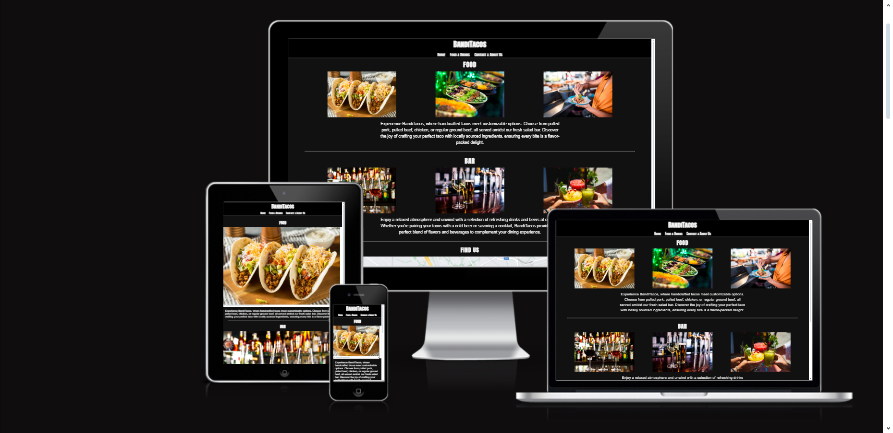 | 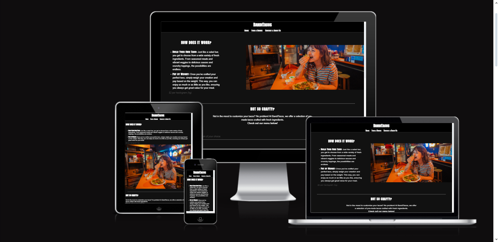 |
| 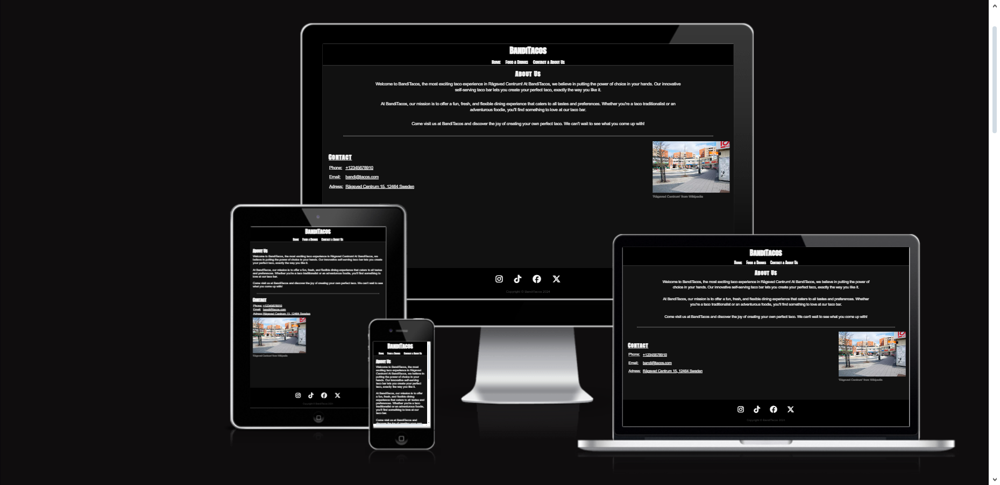 |

## Features

- __Header & Navigation bar__

  - Header/logo leading to homepage with navigation bar containing'Home', 'Food & Drinks' and 'About us & Contact', visible on all three pages. Underline appears while hovering over the different options.
  - Allows users to transition smoothly between all pages within the site. 

| 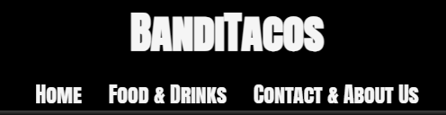 |

- __Home page food & bar preview__

  - Preview of what some of the food and drinks at the resturant has to offer.
  - Lets user know what the resturants food & bar looks like and helps them decide whether or not they might want to visit the resturant or look through more menus. Added text to explain the resturants athmosphere and gimmick.

| 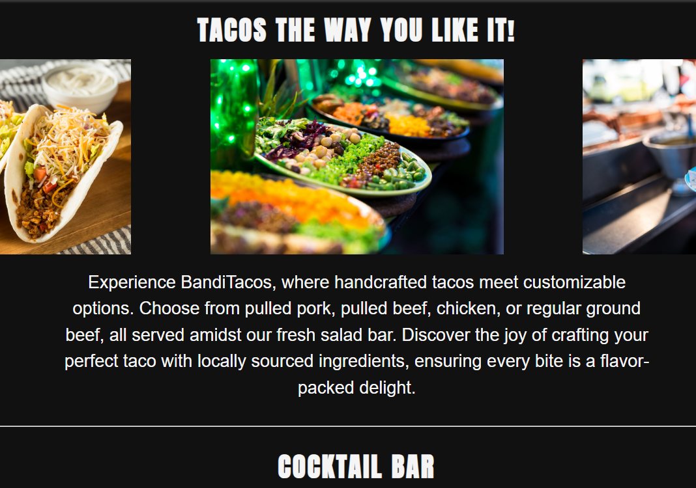 |

  - Mobile phone can preview same images by sliding the images left and right.

| 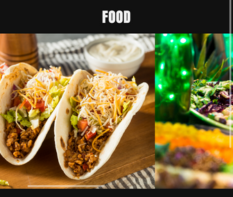 |

- __Map on home page__

  - iFrame containing a map layout of the resturants location. Clicking opens maps directing to the location.
  - Allows users to get a quick answer to where BandiTacos is located.

| 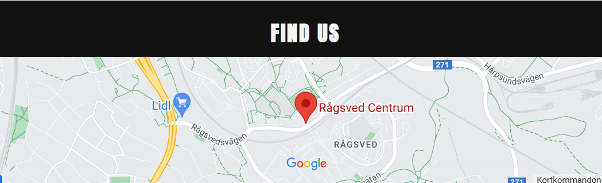 |

- __Social links__

  - Footer containing links to social media. Opens in a new tab.
  - Social media links if clicked leads users to social media accounts linked to the resturant.

| 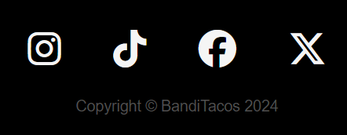 |

- __'How is it done?' section__

  - Instruction on how the resturants gimmick work.
  - For first time customers to let them know how the self-serving system works at the resturant.

| 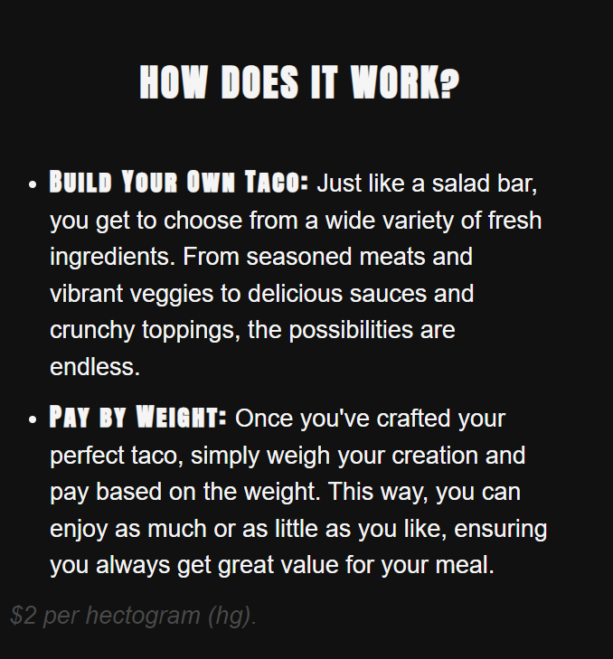 |

- __Food & Drink menu section__

  - List menus with available food at the resturant.
  - Through the menus users get to see what other food than the self-serving system is served at the resturant.

| 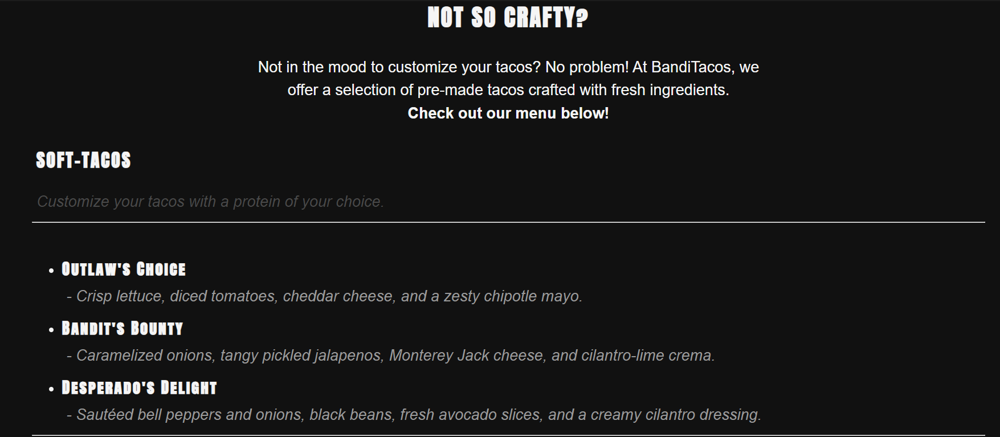 |

- Smaller drink menu to show standard drinks available to order.

| 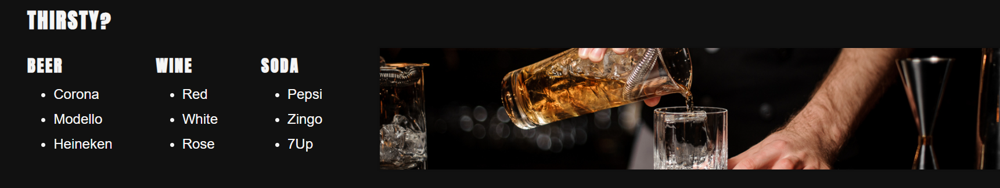 |

- __About us & contact page__

  - About us text welcoming guests and explaining the resturants vision.
  - Contact table with linked Phone, Email and full adress.
  - Image of 'Rågsved centrum' letting users know more about where BandiTacos is located at.

| 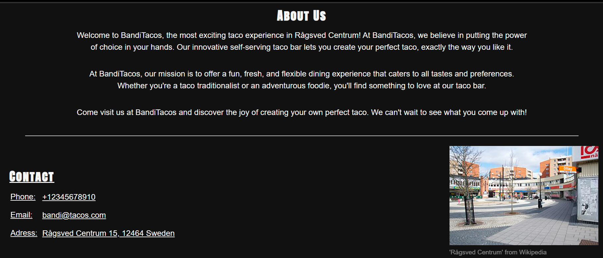 |

### Features Left to Implement

- Add feedback form for users to leave feedback about their visits
- Add banner images to each side of the about us text to make the page feel more alive.

## Testing 

BandiTacos site been tested on both mobile device (iPhone 14 Pro, iPhone 11 Pro), laptop (Asus Vivobook) and "Am I Responsive" website with no detected errors.

#### Header & Navigation

Works as intended and leads user to desired page.

#### Home page slider

Slider made with 'overflow' works on mobile device but didn't work on desktop. Images align horizontally with spacing on desktop instead.

#### iFrame

iFrame loads map correctly and leads to google maps (opens map on mobile) when clicked.

#### Contact

Contact section displaying phone, email and adress all interactable for quick access to calls and mailing. Adress opens maps. Tested and issue-free on all devices.

#### Footer

Social links in footer tested and leads to each social media linked.

### Validator Testing 

- HTML
  - No errors were returned when passing through the official [W3C validator](https://validator.w3.org/nu/?doc=https%3A%2F%2Fcode-institute-org.github.io%2Flove-running-2.0%2Findex.html)
- CSS
  - No errors were found when passing through the official [(Jigsaw) validator](https://jigsaw.w3.org/css-validator/validator?uri=https%3A%2F%2Fvalidator.w3.org%2Fnu%2F%3Fdoc%3Dhttps%253A%252F%252Fcode-institute-org.github.io%252Flove-running-2.0%252Findex.html&profile=css3svg&usermedium=all&warning=1&vextwarning=&lang=en#css)

## Deployment

- The site was deployed to GitHub pages. The steps to deploy are as follows: 
  - In the GitHub repository, navigate to the Settings tab 
  - From the source section drop-down menu, select the Master Branch
  - Once the master branch has been selected, the page will be automatically refreshed with a detailed ribbon display to indicate the successful deployment. 

The live link can be found here - https://imos35.github.io/Project-1-BandiTacos/

## Credits

### Content 

- ChatGPT was used to generate text for descriptions, about us and menus across the site. Also used for aria-labeling
- The icons in the footer were taken from [Font Awesome](https://fontawesome.com/)
- Favicon was taken from [IconDuck](https://iconduck.com/emojis/44364/taco) and generated to Favicon through [RealFaviconGen](https://realfavicongenerator.net)

### Media

- All images of food and drinks were taken from [iStock](https://www.istockphoto.com/se)
- Picture of 'Rågsved centrum' was taken from [Wikipedia](https://sv.wikipedia.org/wiki/Rågsved)